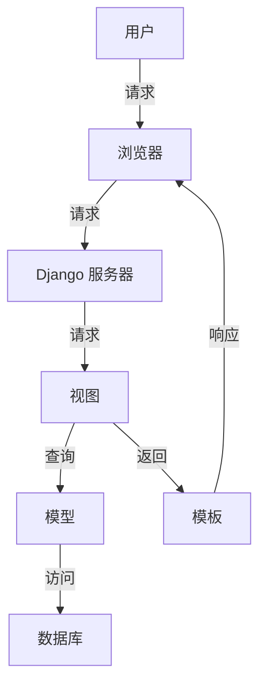

# stock

# mac python 环境
conda base

# stock

```mermaid
graph TD
    A[用户] -->|请求| B[浏览器]
    B -->|请求| C[Django 服务器]
    C -->|请求| D[视图]
    D -->|查询| E[模型]
    E -->|访问| F[数据库]
    D -->|返回| G[模板]
    G -->|响应| B
```

